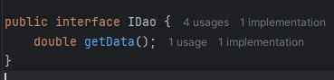
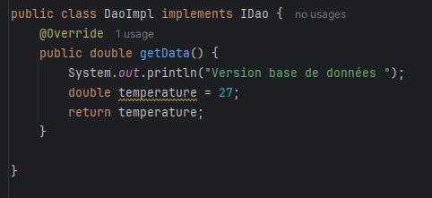
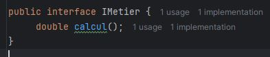
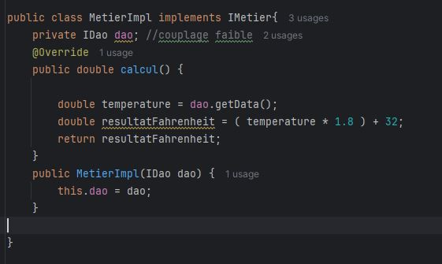
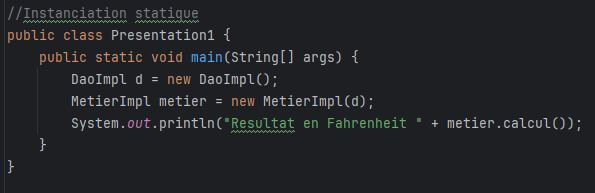
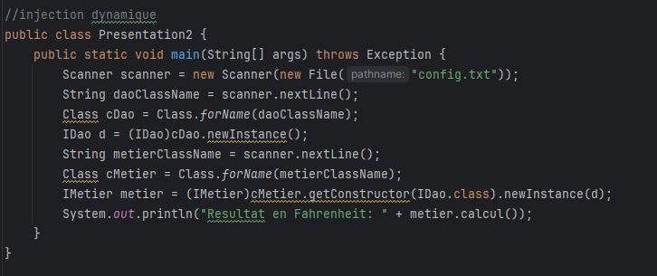
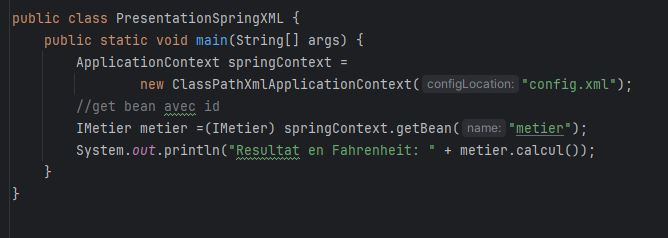

## Objectif

Ce travail a pour objectif de mettre en pratique le principe de couplage faible en Java,

**Étapes de réalisation :**

1. Création de l’interface IDao :

   Une interface nommée IDao a été définie. Elle déclare une méthode abstraite getData() qui sera implémentée ultérieurement :

2. Implémentation de l’interface IDao :

   Une classe DaoImpl a été créée pour implémenter l’interface IDao. Elle fournit une version concrète de la méthode getData() :

3. Création de l’interface IMetier :

   L’interface IMetier a été créée afin de représenter une couche métier. Elle contient une méthode abstraite calcul():

4. Implémentation de l’interface IMetier avec couplage faible :

   Pour respecter le principe de couplage faible, une classe MetierImpl a été développée. Cette classe dépend de l’interface IDao et non de sa classe d’implémentation :

5. L'injection des dépendances :

   a. Par instanciation statique :

La classe DaoImpl est instanciée directement à l'aide de new DaoImpl(), puis elle est injectée dans le constructeur de la classe MetierImpl.
L'injection de dépendances par instanciation statique se fait au moment de la compilation, où les objets sont créés explicitement à l'aide de leurs constructeurs.

   b. Par instanciation dynamique :

les classes DaoImpl et MetierImpl sont chargées dynamiquement à l'exécution via la réflexion (Class.forName()),
et les instances sont créées avec newInstance(). L'instance de DaoImpl est ensuite injectée dans le constructeur de MetierImpl au moment de l'exécution.
L'injection de dépendances par instanciation dynamique utilise la réflexion pour créer des instances d'objets à l'exécution.
Cela permet de charger des classes et d'injecter des dépendances sans connaître les types à la compilation

   c. En utilisant le Framework Spring :

L'injection des dépendances a été implémentée en utilisant le Framework Spring, selon deux approches :

- Version XML :

Dans cette approche, la configuration des beans est définie dans un fichier XML (config.xml).
Les classes et leurs dépendances y sont déclarées manuellement, permettant à Spring de gérer leur instanciation et leur injection.

